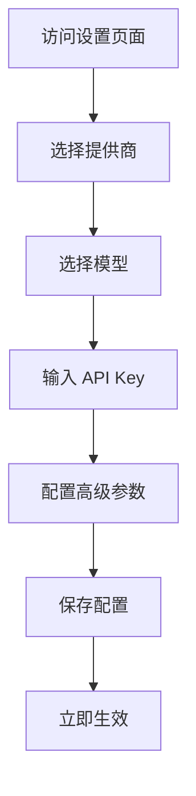

# 前端 LLM 配置功能

## 概述

Agentic Deep Research System 现在支持通过前端界面动态配置 LLM 提供商和模型。用户无需修改环境变量或重启服务，即可实时切换 LLM 配置。

## 功能特性

### 1. 支持的 LLM 提供商
- **通义千问 (Qwen)** - 阿里云大模型，中文能力强
- **DeepSeek** - 国产大模型，性价比极高
- **OpenAI** - GPT 系列，国际领先

### 2. 配置项
- **提供商选择**：下拉菜单选择 LLM 提供商
- **模型选择**：根据提供商显示可用模型
- **API Key**：安全输入，加密存储
- **API Base URL**：支持自定义 API 端点
- **高级参数**：Temperature、Max Tokens
- **备用模型**：主模型失败时自动切换

### 3. 数据存储
- **数据库存储**：配置保存到 PostgreSQL `system_config` 表
- **运行时缓存**：配置立即生效，无需重启
- **安全加密**：API Key 加密存储，前端显示脱敏

## 使用指南

### 1. 访问配置界面
1. 点击右上角 **设置** 按钮
2. 进入 LLM 配置页面
3. 填写配置信息并保存

### 2. 配置步骤


### 3. 配置示例

#### 通义千问配置
```
提供商: 通义千问 (Qwen)
模型: Qwen Plus
API Key: sk-xxxxxxxxxxxxxxxxxxxxxxxx
API Base: https://dashscope.aliyuncs.com/compatible-mode/v1
Temperature: 0.7
Max Tokens: 8192
```

#### DeepSeek 配置
```
提供商: DeepSeek
模型: DeepSeek Chat
API Key: sk-xxxxxxxxxxxxxxxxxxxxxxxx
API Base: https://api.deepseek.com/v1
Temperature: 0.3
Max Tokens: 4096
```

## 技术实现

### 后端 API
```python
# API 端点
GET  /api/v1/config/llm          # 获取当前配置
POST /api/v1/config/llm          # 更新配置
GET  /api/v1/config/llm/status   # 获取配置状态
GET  /api/v1/config/llm/providers # 获取可用提供商
DELETE /api/v1/config/llm        # 重置为默认配置
```

### 数据库表
```sql
CREATE TABLE system_config (
    config_key VARCHAR(50) PRIMARY KEY,
    config_data JSONB NOT NULL DEFAULT '{}',
    description TEXT,
    created_at TIMESTAMP WITH TIME ZONE DEFAULT NOW(),
    updated_at TIMESTAMP WITH TIME ZONE DEFAULT NOW()
);
```

### 配置优先级
1. **运行时配置** - 通过前端设置的最新配置
2. **数据库配置** - 之前保存的配置
3. **环境变量** - `.env` 文件中的默认配置

## 前端组件

### LLMConfigPanel
```typescript
interface LLMConfigPanelProps {
  onClose?: () => void;
}

// 主要功能
- 提供商选择卡片
- 模型下拉菜单
- API Key 安全输入
- 高级设置展开面板
- 备用模型配置
- 保存/重置按钮
```

### 状态管理
```typescript
// 使用 React Query 管理状态
const { data: config } = useQuery(['llm-config'], fetchConfig);
const updateMutation = useMutation(updateConfig);
const resetMutation = useMutation(resetConfig);
```

## 安全考虑

### 1. API Key 安全
- **前端显示**：只显示前 8 位和后 4 位，中间用 `...` 隐藏
- **传输加密**：HTTPS 传输，防止中间人攻击
- **存储加密**：数据库加密存储，不存储明文

### 2. 输入验证
- **API Key 格式**：验证基本格式
- **模型兼容性**：验证提供商与模型匹配
- **参数范围**：Temperature (0-2), Max Tokens (256-32768)

### 3. 权限控制
- **配置权限**：所有用户可配置
- **重置权限**：需要确认操作
- **审计日志**：记录配置变更

## 故障排除

### 1. 配置不生效
```bash
# 检查 API 端点
curl http://localhost:8000/api/v1/config/llm/status

# 检查数据库
psql -d deepintel -c "SELECT * FROM system_config WHERE config_key='llm';"

# 检查运行时缓存
# 重启服务清除缓存
```

### 2. API Key 无效
```bash
# 测试 API 连接
curl -X POST https://api.deepseek.com/v1/chat/completions \
  -H "Authorization: Bearer YOUR_API_KEY" \
  -H "Content-Type: application/json" \
  -d '{"model": "deepseek-chat", "messages": [{"role": "user", "content": "Hello"}]}'
```

### 3. 模型不可用
```bash
# 检查提供商支持的模型
curl http://localhost:8000/api/v1/config/llm/providers

# 切换为推荐的模型
# Qwen: qwen-plus
# DeepSeek: deepseek-chat
# OpenAI: gpt-4o
```

## 最佳实践

### 1. 生产环境配置
```env
# 设置默认配置
LLM_PROVIDER=qwen
LLM_MODEL=qwen-plus
LLM_API_KEY=sk-production-key

# 启用备用模型
FALLBACK_PROVIDER=deepseek
FALLBACK_MODEL=deepseek-chat
FALLBACK_API_KEY=sk-backup-key
```

### 2. 监控配置变更
```bash
# 监控配置表
watch -n 60 "psql -d deepintel -c \"SELECT updated_at FROM system_config WHERE config_key='llm';\""

# 日志监控
tail -f /var/log/deepintel/app.log | grep "LLM config"
```

### 3. 定期轮换 API Key
```bash
# 每月轮换一次
# 1. 生成新 API Key
# 2. 通过前端更新配置
# 3. 验证新配置生效
# 4. 禁用旧 API Key
```

## 扩展功能

### 1. 多租户支持
```python
# 每个用户有自己的配置
class UserLLMConfig(BaseModel):
    user_id: str
    provider: str
    model: str
    api_key: str  # 用户级加密
```

### 2. 配置模板
```python
# 预定义配置模板
config_templates = {
    "research": {"temperature": 0.3, "max_tokens": 4096},
    "creative": {"temperature": 1.0, "max_tokens": 2048},
    "analysis": {"temperature": 0.1, "max_tokens": 8192},
}
```

### 3. 成本监控
```python
# 记录每次调用的成本
class LLMCostRecord(BaseModel):
    session_id: str
    provider: str
    model: str
    tokens_used: int
    cost_usd: float
    timestamp: datetime
```

## 总结

前端 LLM 配置功能提供了：
- **用户友好**：无需技术背景即可配置
- **实时生效**：配置立即应用，无需重启
- **安全可靠**：API Key 加密存储和传输
- **灵活切换**：支持多个提供商和模型
- **故障恢复**：备用模型自动切换

此功能大大降低了系统的使用门槛，使非技术用户也能轻松配置和切换 LLM 提供商。
